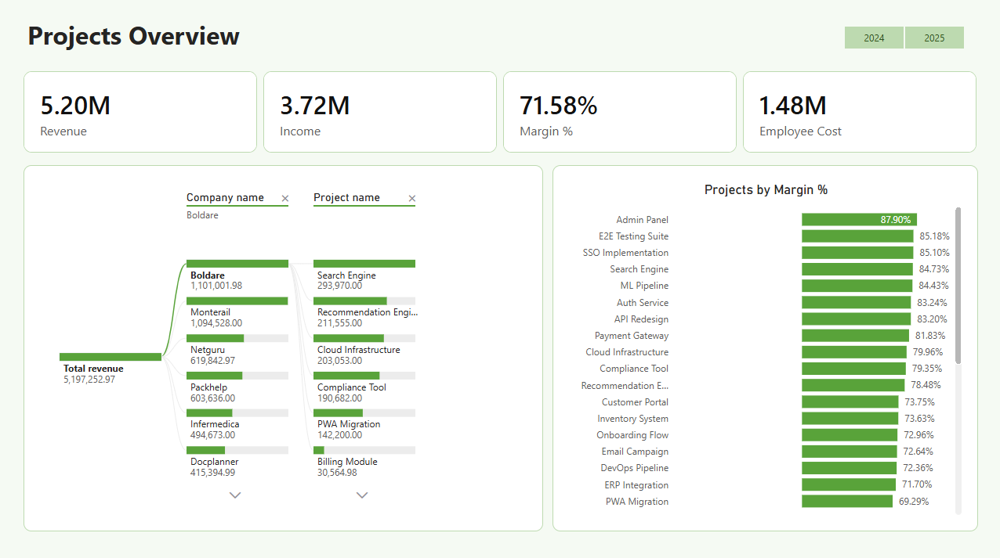
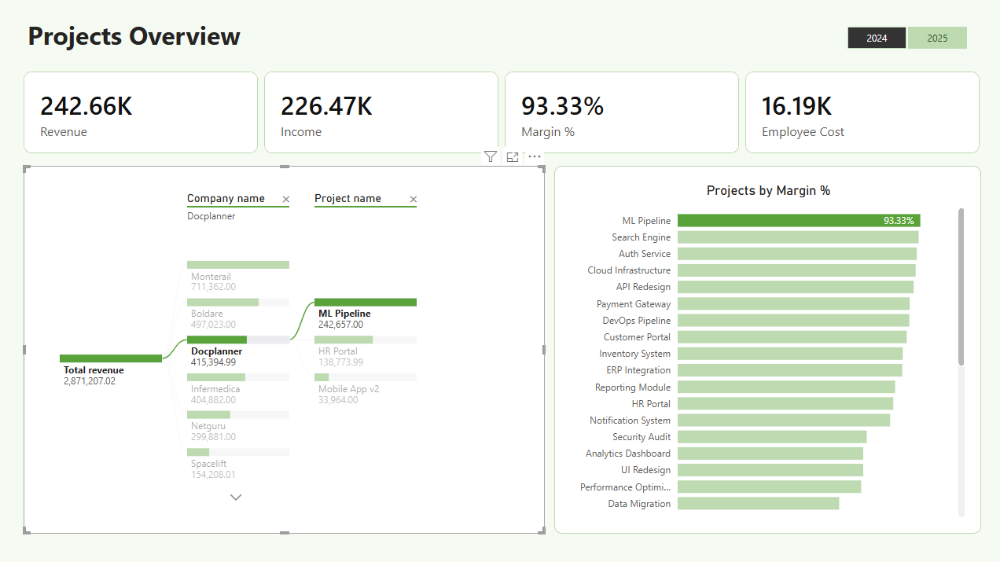
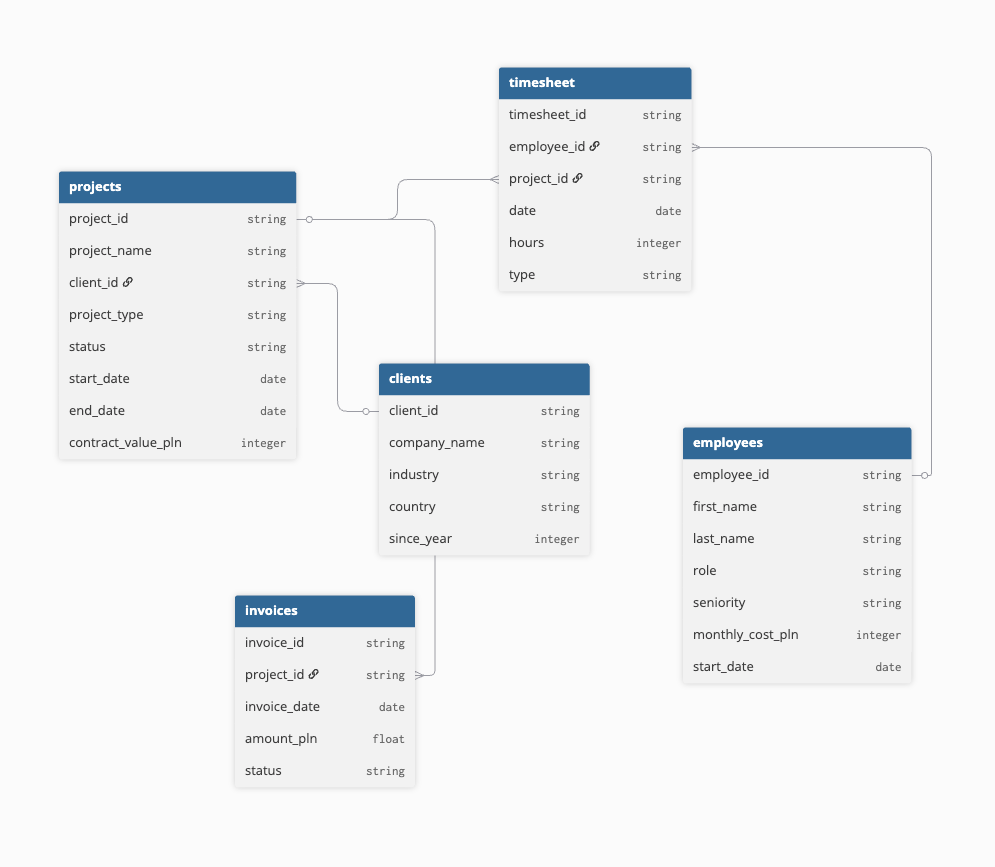
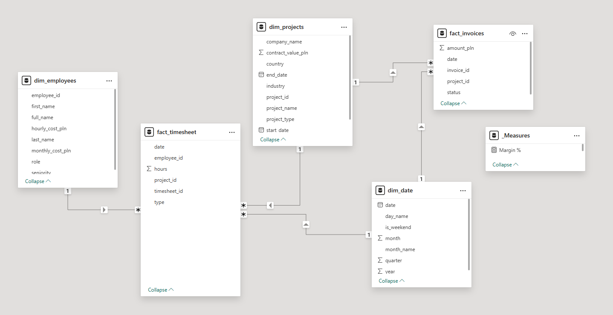

# Projects Overview Power BI Dashboard

## The Goal
The goal of this project was to create a dashboard that would present a projects overview for an IT company.

The dashboard shows revenue, margin (%) and employee cost. Below there is also a clustered bar chart of projects by margin and a drill down of the revenue per company and then per project.

Power BI makes the dashboard really easy to filter by clicking on a chosen year, company or project.

## Data
For this project I used synthetic data generated by AI. The model I used was Claude Sonnet 4.6.

The data (bronze layer) was loaded to BigQuery for later cleaning and processing.

Below you can find the diagram showing how the data in each source is connected to each other (data types are BigQuery data types.)

### Source Tables

**clients**
| Column | Type | Description |
|---|---|---|
| client_id | string | Primary key |
| company_name | string | Client company name |
| industry | string | e.g. SaaS, Fintech, E-commerce |
| country | string | Client country |
| since_year | integer | Year the client relationship started |

**employees**
| Column | Type | Description |
|---|---|---|
| employee_id | string | Primary key |
| first_name | string | |
| last_name | string | |
| role | string | e.g. Developer, QA Engineer, Project Manager |
| seniority | string | Junior / Mid / Senior |
| monthly_cost_pln | integer | Total employer cost per month |
| start_date | date | Employment start date |

**projects**
| Column | Type | Description |
|---|---|---|
| project_id | string | Primary key |
| project_name | string | |
| client_id | string | Foreign key → clients |
| project_type | string | Fixed-price or T&M |
| status | string | Active / Completed / On Hold |
| start_date | date | |
| end_date | date | Null if project is still active |
| contract_value_pln | integer | Total contract value |

**invoices**
| Column | Type | Description |
|---|---|---|
| invoice_id | string | Primary key, format: FA/YYYY/XXXXXXXX |
| project_id | string | Foreign key → projects |
| invoice_date | date | |
| amount_pln | float | Invoice amount |
| status | string | Paid / Pending / Overdue |

**timesheet**
| Column | Type | Description |
|---|---|---|
| timesheet_id | string | Primary key |
| employee_id | string | Foreign key → employees |
| project_id | string | Foreign key → projects |
| date | date | |
| hours | integer | Hours logged |
| type | string | billable or internal |

## Cleaning Data (silver layer)
The first step was to clean the data and create a silver layer. There were some intentional problems in the files to better mimic real business data that is messy and sometimes has missing values.

I checked each source for nulls, typos, duplicates and inconsistent formatting using SQL inside the BigQuery interface with queries using GROUP BY, DISTINCT, IS NULL, etc.

The queries I used to create new tables for the silver layer can be found in the `queries/silver` folder.

Below are the problems I found and resolved:
- **employees:** there was a typo in one of the records — the role was set to "Develeper" instead of "Developer"
- **timesheet:** the date column was interpreted as a string in BigQuery because of inconsistent formatting (examples: 2025-07-08, 19/01/2024, 26.03.2025). I parsed the date using regex and the PARSE_DATE function. I assumed that the dates in the column always follow one of two orders: day/month/year or year/month/day (both widely used in Europe) and not the US notation of month/day/year.
- **timesheet:** the hours and type columns had nulls. In a real project I would talk to the data owner to get to the bottom of this and find out why these columns have nulls and what the best course of action would be. I would also check the source system (the data may have gotten corrupted during export). For this project I had to make an assumption: nulls in the `type` column I interpreted as "internal" and nulls in the `hours` column as 0.
- **timesheet:** there were 5 duplicate entries which I removed in the silver layer.

## Star/Constellation Schema (gold layer)
The last step of data preparation was to model it for use in Power BI. The recommended model for Power BI is star schema. In our case it is a constellation schema since we have two fact tables:

- fact_invoices
- fact_timesheet
- dim_projects (also includes client information)
- dim_employees
- dim_date

For `dim_employees` I also calculated `hourly_cost_pln` by dividing `monthly_cost_pln` by 160 (standard working hours per month). This is used later in Power BI to calculate the employee cost per project.

All the queries used to create these tables for the gold layer can be found in `queries/gold`.

> **Note:** the dim_date query was giving me some trouble. Since I didn't use any existing table to create it, BigQuery was defaulting to the US data region despite my attempts to change that. My `gold` dataset was in the EU region and the query results couldn't be saved there. I worked around this by rewriting the query to reference an existing EU table, which is why the query looks a bit unusual.

## Power BI

The dashboard has 4 KPI cards which contain values from measures created and stored in a `_Measures` table:
- **Revenue (PLN)** — measure: `Total Revenue = SUM(fact_invoices[amount_pln])`
- **Income (PLN)** — measure: `Total Income = [Total Revenue] - [Total Employee Cost]`
- **Margin %** — measure: `Margin % = DIVIDE([Margin Amount], [Total Revenue], 0)`
- **Employee Cost** — measure: `Total Employee Cost = SUMX(fact_timesheet, fact_timesheet[hours] * RELATED(dim_employees[hourly_cost_pln]))`

Below the KPI cards there is a decomposition tree showing a drill down from Total Revenue through clients (company name) down to individual projects.

The last visual is **Projects by Margin %** — a clustered bar chart where you can see margin per project and easily spot the most and least profitable ones.

The dashboard can be filtered by year (2024 or 2025) using the slicer at the top.

## How to Open the Dashboard

1. Download and install [Power BI Desktop](https://powerbi.microsoft.com/desktop/) (free)
2. Download `dashboard.pbix` from this repository
3. Open the file in Power BI Desktop

No connection to BigQuery is needed — the data is already embedded in the file.